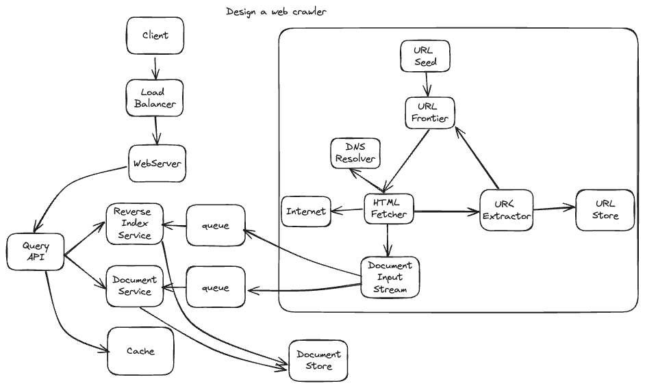

# Design a web crawler

2024.05.20. 이전에 있던 내용은 crawler을 디자인 하는게 너무 부실했었음. crawler를 단 하나의 module로 표기만 하고, 세부적인것을 구현해 두지 않았었음. 그래서 다른 자료를 추가로 보는게 나을것. search engine이라는 주제와 web crawler를 동시에 봐야함. 그래서 이전에 있던 그림에서 search query 부분을 그대로 보고, web crawler 부분은 새로운 자료를 보는것이 좋을것. Search service와 web crawler는 이전의 그림에서와 같이 queue를 통해서 이어져 있는것을 기본으로 하겠음. 
- [참고] https://www.enjoyalgorithms.com/blog/web-crawler
- [그림/설명 여기를 볼것] https://astikanand.github.io/techblogs/high-level-system-design/design-web-crawler

Search / crawler 통합된 그림. 정확하진 않을것. 


## Step 1: Requireemtns / Functions

### Functions
- Given a set of URLs, visit the URL and store the web page.
- Extract URLs from the visited pages.
- Append new extracted URLs to the list of URLs to visit

### Requirements
- Crawler should be scalable with bilions of pages.
- Crawler should not make too many request to webpages.
- Avoid cycle

### Estimation
- 1B webpages to be crawled per month.
  - Average number of queries per second (QPS) is 400 pages/s = 1*10^9 / 30 / 24 / 60 / 60
- Peak value of queries per second is around twice: 800 pages/s
- Average webpage is 500kb --> storage per month = 10^9 * 500k = 500TB

## Step 2. Main Design

- Seed URLs: 처음에 crawling 시작하는 set of urls. 여기서 시작해서 방문하는 페이지에서 링크된 주소들을 계속 추가해 나가면서 방문 범위를 넓힘. 
- URL frontier: See url에서 시작해서 다음의 방문 페이지를 결정. DFS가 보통 쓰이고, DFS도 쓰일 수 있음. importance를 반영해서 priority queue로 쓸 수 있음.
  - FIFO queue로 구현 가능. 이렇게 하면 해당 페이지가 있는 서버에 과부하를 주지 않는듯.
  - 탐색해야 할 페이지가 많으니, multi-server, multi-thread를 사용해야 하는데, url frontier도 이를 지원해야 함.
  - 아마 전체 서버에 대하여 하나의 url frontier가 있고, 여기서 얻은 url은 hash map을 통해서 url-->server_id/thread_it로 mapping되어서 해당 서버로 할당됨.
  - 각 worker thread에는 이렇게 받아온 url을 저장해 두는 독립적인 sub queue가 존재.
  - 전체 방문해야 할 페이지가 많기때문에, url frontier는 disk에 저장하는것이 바람직함. 
- HTML fetcher: Download webpages from the given URL from URL frontier.
- DNS Resolver: 웹페이지가 다운되기 전에 URL이 IP 주소로 변환되어야 하나봄. 이게 DNS의 역할임. domain name을 ip address로 변환하는게 DNS가 하는 일인데, 이 변환 속도가 bottleneck이 되어서 전체 시스템의 속도를 느리게 할 수 있음. 그래서 custom DNS를 쓰기도 함. 
- HTML parser: 웹페이지를 다운받으면, HTML 형식인데, 여기서 메인 텍스트만 뽑아냄. 적절하지 않는 내용을 걸러내기도 함.
- Document Input Stream (DIS): 하나의 문서가 여러개의 processing module에 의해서 처리될 수 있어야 함 (url extraction, document duplication check ..). 이를 위해서 문서를 여러번 다운받지 않고도 여러 모듈에서의 접근이 가능해야 하는데, 이것을 DIS가 가능하게 함 as a cache. 정당히 작은 크기의 문서만 cache 할 수 있고, 너무 크면 backing file로 써야함. 
- Duplicate detection: 다운받은 페이지가 중복되는지를 확인. MD5 hashing을 사용해서 동일한 hash key가 이미 저장되었는지 확인 (mirrored site)
- Data storage: Parse된 text를 저장. offline 저장 용도로 쓰일거면 낮은 가격의 높은 볼륨 저장장치 사용, 온라인 search로 쓸거면 large-scale distributed system (noSQL) 같은곳에 저장.
- Cache: 최근에 방문된 url을 저장. 나중에 여기를 보고 중복을 피함.
- URL extractor: 페이지 내에서 링크된 url을 찾음.
- URL filter: 잘못되거나 좋지 않은 url 제거.
- URL detector: 이전에 방문한 url인지 학인하고 제거.
- URL storage: 이전에 방문한 모든 URL을 저장. 


*Note: This document links directly to relevant areas found in the [system design topics](https://github.com/donnemartin/system-design-primer#index-of-system-design-topics) to avoid duplication.  Refer to the linked content for general talking points, tradeoffs, and alternatives.*

## Step 1: Outline use cases and constraints

> Gather requirements and scope the problem.
> Ask questions to clarify use cases and constraints.
> Discuss assumptions.

Without an interviewer to address clarifying questions, we'll define some use cases and constraints.

### Use cases

#### We'll scope the problem to handle only the following use cases

* **Service** crawls a list of urls:
    * Generates reverse index of words to pages containing the search terms
    * Generates titles and snippets for pages
        * Title and snippets are static, they do not change based on search query
* **User** inputs a search term and sees a list of relevant pages with titles and snippets  the crawler generated
    * Only sketch high level components and interactions for this use case, no need to go into depth
* **Service** has high availability

#### Out of scope

* Search analytics
* Personalized search results
* Page rank

### Constraints and assumptions

#### State assumptions

* Traffic is not evenly distributed
    * Some searches are very popular, while others are only executed once
* Support only anonymous users
* Generating search results should be fast
* The web crawler should not get stuck in an infinite loop
    * We get stuck in an infinite loop if the graph contains a cycle
* 1 billion links to crawl
    * Pages need to be crawled regularly to ensure freshness
    * Average refresh rate of about once per week, more frequent for popular sites
        * 4 billion links crawled each month
    * Average stored size per web page: 500 KB
        * For simplicity, count changes the same as new pages
* 100 billion searches per month
* Robot.txt 규정 준수
* Multi-thread or workers are needed. 

Exercise the use of more traditional systems - don't use existing systems such as [solr](http://lucene.apache.org/solr/) or [nutch](http://nutch.apache.org/).

#### Calculate usage

**Clarify with your interviewer if you should run back-of-the-envelope usage calculations.**

* 2 PB of stored page content per month
    * 500 KB per page * 4 billion links crawled per month
    * 72 PB of stored page content in 3 years
* 1,600 write requests per second
* 40,000 search requests per second

Handy conversion guide:

* 2.5 million seconds per month
* 1 request per second = 2.5 million requests per month
* 40 requests per second = 100 million requests per month
* 400 requests per second = 1 billion requests per month

## Step 2: Create a high level design

> Outline a high level design with all important components.


## Step 3: Design core components

> Dive into details for each core component.

위 그림에서 
- Reverse Index Service: reverse index는 특정 word를 포함하는 document들을 indexing 해 둔것임. 예를들어 word "apple"을 포함하는 문서들이 1, 30, 245번 문서라면, 이 문서 index들을 word apple과 연결시켜 저장하는것임. index['apple'] = [1, 30, 245] 식으로.
- Document Servkce: 해당 문서의 text에서 static title, snippet을 생성. 대강 text를 다루고 저장한다고 생각하면 될것. 구글 검색 결과에 나오는 title과 snippet을 생각하면 될것임. 
- Queue를 쓰는 이유는, asynchronous work을 위해서 그런듯.

어떤 데이터를 저장?
- crawler가 webpage를 방문하면, title, text, metadata 정도를 추출해서 저장하는데, 이것은 real-time search를 위해서 noSQL에 바로 저장을 한다. object store에 저장을 하면 너무 느려서 real time search가 안된다고 함. 

### Use case: Service crawls a list of urls

We'll assume we have an initial list of `links_to_crawl` ranked initially based on overall site popularity.  If this is not a reasonable assumption, we can seed the crawler with popular sites that link to outside content such as [Yahoo](https://www.yahoo.com/), [DMOZ](http://www.dmoz.org/), etc.

`links_to_crawl`은 단순히 url만 저장하는게 아니라, 여러가지 정보를 저장함. 
- Prioirty or rank: 얼마나 중요한 사이트인지, 얼마나 자주 refresh 해야하는지
- timestamp: 언제 해당 url이 추가되었는지 / 언제 crawling schedule이 되어야 하는지
- source data: 어디서 해당 url이 발견되었는지. 이게 analizying에 필요하다고 함. 

We'll use a table `crawled_links` to store processed links and their page signatures.

We could store `links_to_crawl` and `crawled_links` in a key-value **NoSQL Database**.  For the ranked links in `links_to_crawl`, we could use [Redis](https://redis.io/) with sorted sets to maintain a ranking of page links.  We should discuss the [use cases and tradeoffs between choosing SQL or NoSQL](https://github.com/donnemartin/system-design-primer#sql-or-nosql). 주된 이유로는, 데이터가 크다는것이 있음. SQL보다 scaling이 편하고 속도가 빠른 noSQL을 사용함. 그리고 sorted set을 제공해서 rank에 대해서 sort를 쉽게 할 수 있다는 장점도 있음. 

* The **Crawler Service** processes each page link by doing the following in a loop:
    * Takes the top ranked page link to crawl
        * Checks `crawled_links` in the **NoSQL Database** for an entry with a similar page signature
            * If we have a similar page, reduces the priority of the page link
                * This prevents us from getting into a cycle
                * Continue
            * Else, crawls the link
                * Adds a job to the **Reverse Index Service** queue to generate a [reverse index](https://en.wikipedia.org/wiki/Search_engine_indexing)
                * Adds a job to the **Document Service** queue to generate a static title and snippet
                * Generates the page signature
                * Removes the link from `links_to_crawl` in the **NoSQL Database**
                * Inserts the page link and signature to `crawled_links` in the **NoSQL Database**

**Clarify with your interviewer how much code you are expected to write**.

`PagesDataStore` is an abstraction within the **Crawler Service** that uses the **NoSQL Database**:

```python
class PagesDataStore(object):

    def __init__(self, db);
        self.db = db
        ...

    def add_link_to_crawl(self, url):
        """Add the given link to `links_to_crawl`."""
        ...

    def remove_link_to_crawl(self, url):
        """Remove the given link from `links_to_crawl`."""
        ...

    def reduce_priority_link_to_crawl(self, url)
        """Reduce the priority of a link in `links_to_crawl` to avoid cycles."""
        ...

    def extract_max_priority_page(self):
        """Return the highest priority link in `links_to_crawl`."""
        ...

    def insert_crawled_link(self, url, signature):
        """Add the given link to `crawled_links`."""
        ...

    def crawled_similar(self, signature):
        """Determine if we've already crawled a page matching the given signature"""
        ...
```

`Page` is an abstraction within the **Crawler Service** that encapsulates a page, its contents, child urls, and signature:

```python
class Page(object):

    def __init__(self, url, contents, child_urls, signature):
        self.url = url
        self.contents = contents
        self.child_urls = child_urls
        self.signature = signature
```

`Crawler` is the main class within **Crawler Service**, composed of `Page` and `PagesDataStore`.

```python
class Crawler(object):

    def __init__(self, data_store, reverse_index_queue, doc_index_queue):
        self.data_store = data_store
        self.reverse_index_queue = reverse_index_queue
        self.doc_index_queue = doc_index_queue

    def create_signature(self, page):
        """Create signature based on url and contents."""
        ...

    def crawl_page(self, page):
        for url in page.child_urls:
            self.data_store.add_link_to_crawl(url)
        page.signature = self.create_signature(page)
        self.data_store.remove_link_to_crawl(page.url)
        self.data_store.insert_crawled_link(page.url, page.signature)

    def crawl(self):
        while True:
            page = self.data_store.extract_max_priority_page()
            if page is None:
                break
            if self.data_store.crawled_similar(page.signature):
                self.data_store.reduce_priority_link_to_crawl(page.url)
            else:
                self.crawl_page(page)
```

### Handling duplicates

We need to be careful the web crawler doesn't get stuck in an infinite loop, which happens when the graph contains a cycle.

**Clarify with your interviewer how much code you are expected to write**.

We'll want to remove duplicate urls:

* For smaller lists we could use something like `sort | unique`
* With 1 billion links to crawl, we could use **MapReduce** to output only entries that have a frequency of 1

```python
class RemoveDuplicateUrls(MRJob):

    def mapper(self, _, line):
        yield line, 1

    def reducer(self, key, values):
        total = sum(values)
        if total == 1:
            yield key, total
```

Detecting duplicate content is more complex.  We could generate a signature based on the contents of the page and compare those two signatures for similarity.  Some potential algorithms are [Jaccard index](https://en.wikipedia.org/wiki/Jaccard_index) and [cosine similarity](https://en.wikipedia.org/wiki/Cosine_similarity).

### Determining when to update the crawl results

Pages need to be crawled regularly to ensure freshness.  Crawl results could have a `timestamp` field that indicates the last time a page was crawled.  After a default time period, say one week, all pages should be refreshed.  Frequently updated or more popular sites could be refreshed in shorter intervals.

Although we won't dive into details on analytics, we could do some data mining to determine the mean time before a particular page is updated, and use that statistic to determine how often to re-crawl the page.

We might also choose to support a `Robots.txt` file that gives webmasters control of crawl frequency.

### Use case: User inputs a search term and sees a list of relevant pages with titles and snippets

* The **Client** sends a request to the **Web Server**, running as a [reverse proxy](https://github.com/donnemartin/system-design-primer#reverse-proxy-web-server)
* The **Web Server** forwards the request to the **Query API** server
* The **Query API** server does the following:
    * Parses the query
        * Removes markup
        * Breaks up the text into terms
        * Fixes typos
        * Normalizes capitalization
        * Converts the query to use boolean operations
    * Uses the **Reverse Index Service** to find documents matching the query
        * The **Reverse Index Service** ranks the matching results and returns the top ones
    * Uses the **Document Service** to return titles and snippets

We'll use a public [**REST API**](https://github.com/donnemartin/system-design-primer#representational-state-transfer-rest):

```
$ curl https://search.com/api/v1/search?query=hello+world
```

Response:

```
{
    "title": "foo's title",
    "snippet": "foo's snippet",
    "link": "https://foo.com",
},
{
    "title": "bar's title",
    "snippet": "bar's snippet",
    "link": "https://bar.com",
},
{
    "title": "baz's title",
    "snippet": "baz's snippet",
    "link": "https://baz.com",
},
```

For internal communications, we could use [Remote Procedure Calls](https://github.com/donnemartin/system-design-primer#remote-procedure-call-rpc).

## Step 4: Scale the design

> Identify and address bottlenecks, given the constraints.


**Important: Do not simply jump right into the final design from the initial design!**

State you would 1) **Benchmark/Load Test**, 2) **Profile** for bottlenecks 3) address bottlenecks while evaluating alternatives and trade-offs, and 4) repeat.  See [Design a system that scales to millions of users on AWS](../scaling_aws/README.md) as a sample on how to iteratively scale the initial design.

It's important to discuss what bottlenecks you might encounter with the initial design and how you might address each of them.  For example, what issues are addressed by adding a **Load Balancer** with multiple **Web Servers**?  **CDN**?  **Master-Slave Replicas**?  What are the alternatives and **Trade-Offs** for each?

We'll introduce some components to complete the design and to address scalability issues.  Internal load balancers are not shown to reduce clutter.

*To avoid repeating discussions*, refer to the following [system design topics](https://github.com/donnemartin/system-design-primer#index-of-system-design-topics) for main talking points, tradeoffs, and alternatives:

* [DNS](https://github.com/donnemartin/system-design-primer#domain-name-system)
* [Load balancer](https://github.com/donnemartin/system-design-primer#load-balancer)
* [Horizontal scaling](https://github.com/donnemartin/system-design-primer#horizontal-scaling)
* [Web server (reverse proxy)](https://github.com/donnemartin/system-design-primer#reverse-proxy-web-server)
* [API server (application layer)](https://github.com/donnemartin/system-design-primer#application-layer)
* [Cache](https://github.com/donnemartin/system-design-primer#cache)
* [NoSQL](https://github.com/donnemartin/system-design-primer#nosql)
* [Consistency patterns](https://github.com/donnemartin/system-design-primer#consistency-patterns)
* [Availability patterns](https://github.com/donnemartin/system-design-primer#availability-patterns)

Some searches are very popular, while others are only executed once.  Popular queries can be served from a **Memory Cache** such as Redis or Memcached to reduce response times and to avoid overloading the **Reverse Index Service** and **Document Service**.  The **Memory Cache** is also useful for handling the unevenly distributed traffic and traffic spikes.  Reading 1 MB sequentially from memory takes about 250 microseconds, while reading from SSD takes 4x and from disk takes 80x longer.<sup><a href=https://github.com/donnemartin/system-design-primer#latency-numbers-every-programmer-should-know>1</a></sup>

Below are a few other optimizations to the **Crawling Service**:

* To handle the data size and request load, the **Reverse Index Service** and **Document Service** will likely need to make heavy use sharding and federation.
     - Sharding / federation은 SQL에만 적용되는게 아니라 noSQL에도 적용됨. 
* DNS lookup can be a bottleneck, the **Crawler Service** can keep its own DNS lookup that is refreshed periodically
  * DNS가 보통 느리다고 함. 그래서 customized DNS를 만들어서 사용하는게 편하대. Cache같은 개념으로 ip-domain을 연결하는데, 주기적으로 refreshed 되어야 함. 
* The **Crawler Service** can improve performance and reduce memory usage by keeping many open connections at a time, referred to as [connection pooling](https://en.wikipedia.org/wiki/Connection_pool)
    * Switching to [UDP](https://github.com/donnemartin/system-design-primer#user-datagram-protocol-udp) could also boost performance
* Web crawling is bandwidth intensive, ensure there is enough bandwidth to sustain high throughput

## Additional talking points

> Additional topics to dive into, depending on the problem scope and time remaining.

### SQL scaling patterns

* [Read replicas](https://github.com/donnemartin/system-design-primer#master-slave-replication)
* [Federation](https://github.com/donnemartin/system-design-primer#federation)
* [Sharding](https://github.com/donnemartin/system-design-primer#sharding)
* [Denormalization](https://github.com/donnemartin/system-design-primer#denormalization)
* [SQL Tuning](https://github.com/donnemartin/system-design-primer#sql-tuning)

#### NoSQL

* [Key-value store](https://github.com/donnemartin/system-design-primer#key-value-store)
* [Document store](https://github.com/donnemartin/system-design-primer#document-store)
* [Wide column store](https://github.com/donnemartin/system-design-primer#wide-column-store)
* [Graph database](https://github.com/donnemartin/system-design-primer#graph-database)
* [SQL vs NoSQL](https://github.com/donnemartin/system-design-primer#sql-or-nosql)

### Caching

* Where to cache
    * [Client caching](https://github.com/donnemartin/system-design-primer#client-caching)
    * [CDN caching](https://github.com/donnemartin/system-design-primer#cdn-caching)
    * [Web server caching](https://github.com/donnemartin/system-design-primer#web-server-caching)
    * [Database caching](https://github.com/donnemartin/system-design-primer#database-caching)
    * [Application caching](https://github.com/donnemartin/system-design-primer#application-caching)
* What to cache
    * [Caching at the database query level](https://github.com/donnemartin/system-design-primer#caching-at-the-database-query-level)
    * [Caching at the object level](https://github.com/donnemartin/system-design-primer#caching-at-the-object-level)
* When to update the cache
    * [Cache-aside](https://github.com/donnemartin/system-design-primer#cache-aside)
    * [Write-through](https://github.com/donnemartin/system-design-primer#write-through)
    * [Write-behind (write-back)](https://github.com/donnemartin/system-design-primer#write-behind-write-back)
    * [Refresh ahead](https://github.com/donnemartin/system-design-primer#refresh-ahead)

### Asynchronism and microservices

* [Message queues](https://github.com/donnemartin/system-design-primer#message-queues)
* [Task queues](https://github.com/donnemartin/system-design-primer#task-queues)
* [Back pressure](https://github.com/donnemartin/system-design-primer#back-pressure)
* [Microservices](https://github.com/donnemartin/system-design-primer#microservices)

### Communications

* Discuss tradeoffs:
    * External communication with clients - [HTTP APIs following REST](https://github.com/donnemartin/system-design-primer#representational-state-transfer-rest)
    * Internal communications - [RPC](https://github.com/donnemartin/system-design-primer#remote-procedure-call-rpc)
* [Service discovery](https://github.com/donnemartin/system-design-primer#service-discovery)

### Security

Refer to the [security section](https://github.com/donnemartin/system-design-primer#security).

### Latency numbers

See [Latency numbers every programmer should know](https://github.com/donnemartin/system-design-primer#latency-numbers-every-programmer-should-know).

### Ongoing

* Continue benchmarking and monitoring your system to address bottlenecks as they come up
* Scaling is an iterative process
